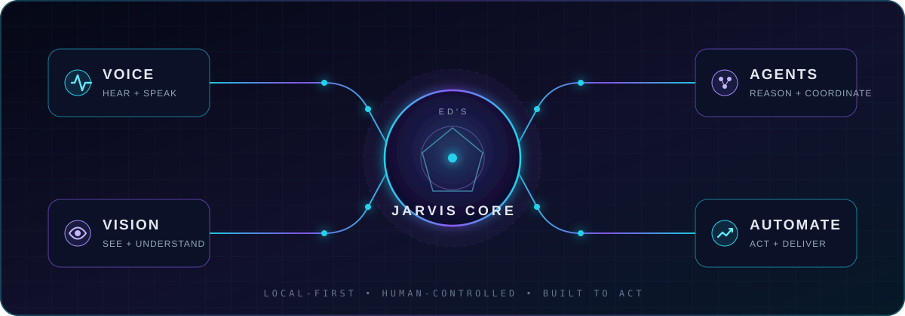

<div align="center">


<a href="https://github.com/Icarus-B4">
  
</a>

[](https://github.com/Icarus-B4)
[](https://webstark.org/jarvis/)
[](https://webstark.org/)

</div>

## `whoami`

I am **Ed**, an independent builder from Swiss focused on AI-native desktop software, voice interfaces and practical automation. I like ambitious systems that do more than answer questions: they see, listen, act and help people get real work done.

My main project is **J.A.R.V.I.S.**, built together with **YOU maybe**: a desktop AI environment that brings agents, voice control, vision, browser workflows and system automation into one interface.

> I do not build demos that merely look intelligent. I build tools that earn a permanent place on the desktop.

<div align="center">
  
</div>

## `current_focus`

```text
01  J.A.R.V.I.S. desktop intelligence     ███████████████████░  shipping
02  Voice-first human–computer interfaces ████████████████░░░░  building
03  Local AI + agent orchestration         ███████████████░░░░░  exploring
04  Useful Windows automation              █████████████████░░░  refining
```

- Desktop agents that can coordinate tools instead of stopping at chat
- Hands-free interaction with speech, vision and optional cursor control
- Local-first workflows where privacy and control stay with the user
- Interfaces that feel cinematic without sacrificing usability

## `selected_builds`

<table>
<tr>
<td width="50%" valign="top">

### [J.A.R.V.I.S.](https://github.com/Icarus-B4/jarvis-desktop_glas)

A desktop AI command center for voice, vision, agents and system automation. Built by **Ed & Jared Rhodenizer**.

`desktop-ai` `voice` `vision` `agents`

</td>
<td width="50%" valign="top">

### [Hermes Avatar Pet](https://github.com/Icarus-B4/hermes-plugin-avatar_pet)

An animated chat avatar plugin for the Hermes Desktop App that gives an AI assistant a visible presence.

`hermes` `plugin` `javascript` `desktop`

</td>
</tr>
<tr>
<td width="50%" valign="top">

### [SurepriseAI](https://github.com/Icarus-B4/SurepriseAi)

A Windows voice-dictation app with live transcription, AI text polishing and a Dynamic Island inspired overlay.

`python` `speech-to-text` `windows` `ai`

</td>
<td width="50%" valign="top">

### [LiveKit Agent Skill](https://github.com/Icarus-B4/LiveKit-Agent-Skill)

Reusable building blocks for real-time voice agents powered by LiveKit and Python.

`livekit` `python` `realtime` `voice-ai`

</td>
</tr>
</table>

## `toolkit`

<div align="center">
  
</div>

<br />

<div align="center">
  
</div>

<details>
<summary><strong>Deutsche Version öffnen</strong></summary>
<br />

## Über mich

Ich bin **Ed**, ein unabhängiger Entwickler aus der Schweiz. Mein Schwerpunkt liegt auf KI-nativen Desktop-Anwendungen, Sprachsteuerung und sinnvoller Automatisierung. Mich interessieren Systeme, die mehr können als Fragen zu beantworten: Sie sollen sehen, zuhören, handeln und Menschen bei echter Arbeit unterstützen.

Mein Hauptprojekt ist **J.A.R.V.I.S.**, das ich gemeinsam mit **Mit dir, vieleicht** entwickle. Es verbindet KI-Agenten, Sprachsteuerung, Vision, Browser-Workflows und Systemautomatisierung in einer Desktop-Oberfläche.

## Woran ich arbeite

- Desktop-Agenten, die Werkzeuge selbstständig koordinieren
- Freihändige Bedienung mit Sprache, Vision und optionaler Cursorsteuerung
- Lokale KI-Workflows mit mehr Privatsphäre und Kontrolle
- Futuristische Oberflächen, die trotz ihrer Wirkung praktisch bleiben

## Ausgewählte Projekte

- **[J.A.R.V.I.S.](https://github.com/Icarus-B4/jarvis-desktop_glas)** — Desktop-Kommandozentrale für Sprache, Vision, Agenten und Automatisierung
- **[Hermes Avatar Pet](https://github.com/Icarus-B4/hermes-plugin-avatar_pet)** — animierter Chat-Avatar für die Hermes Desktop App
- **[SurepriseAI](https://github.com/Icarus-B4/SurepriseAi)** — Windows-Sprachdiktat mit Live-Transkription und KI-Textoptimierung
- **[LiveKit Agent Skill](https://github.com/Icarus-B4/LiveKit-Agent-Skill)** — wiederverwendbare Bausteine für Echtzeit-Sprachagenten

> Ich baue keine Demos, die nur intelligent aussehen. Ich baue Werkzeuge, die einen festen Platz auf dem Desktop verdienen.

</details>

<div align="center">

### Build bold things. Keep them useful.

<sub>Profile engineered by <a href="https://github.com/Icarus-B4">Ed / Icarus-B4</a></sub>

<a href="https://webstark.org/jarvis">

</a>

</div>
